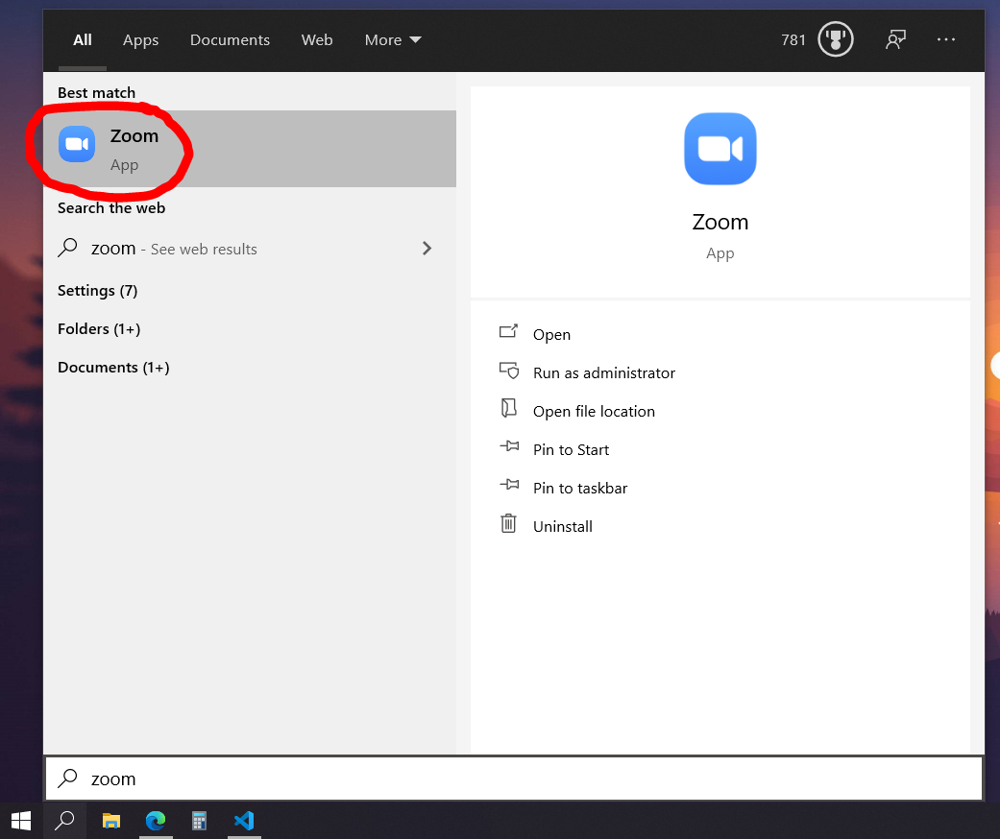
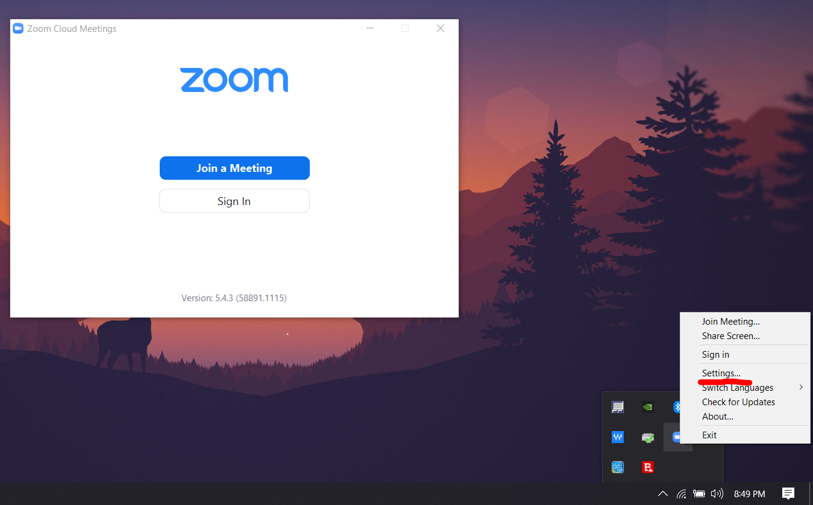
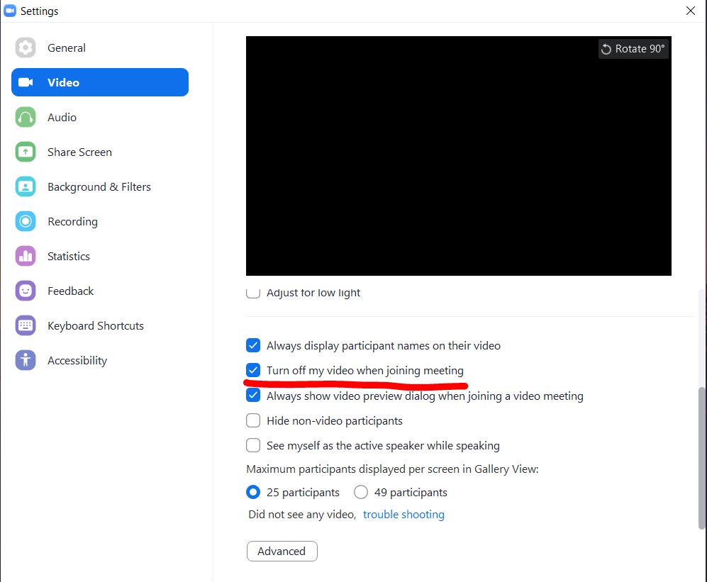
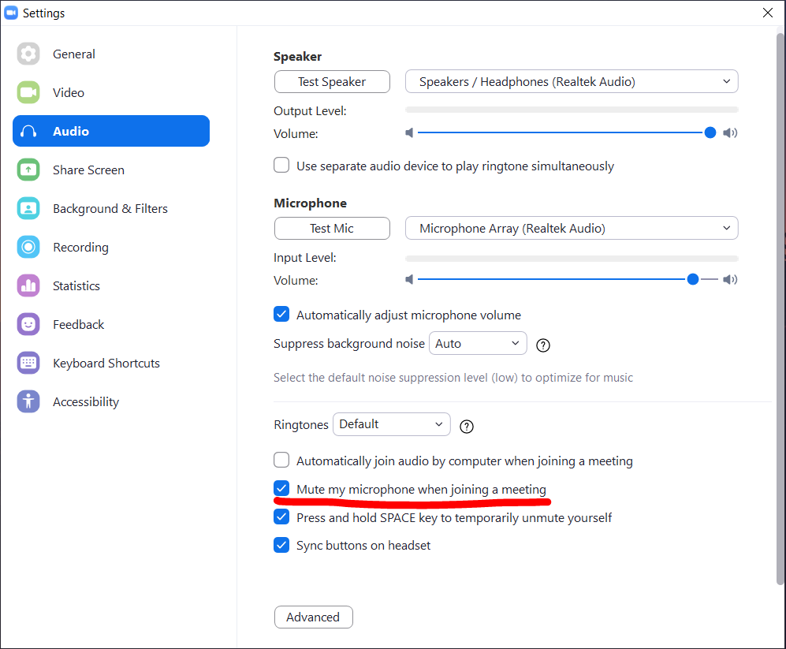

# ProcrastiNot

The **ProcrastiNot** script allows you to automate your zoom call workflow. The script allows you to automatically connect to your zoom call at a specific time and day of the week. This means you don't have to hunt for the URL through hundreds of emails. You can add more than one Zoom meeting link which makes ProcrastiNot useful if you are a student or have frequent recurring meetings.

# Prerequisites
- You must have PowerShell on your computer - Most Windows computers will come with PowerShell installed
- You must have Zoom installed on your computer. Zoom is the only conferencing client supported now.

# The Definition File
The script uses a `.pn` file to define a series of meetings. An example file is provided below.

```
Finance, 9:10 AM, mon/wed/fri, https://zoom.us/j/92990464842?pwd=TDZmWmsadskdFASKDJasdkaB1bkhFUT09  
Algebra, 12:40 PM, fri, https://zoom.us/j/77454415575
Gym, 9:30 AM, tue/thu, https://zoom.us/j/975145451605?pwd=NFdpYVkwS0pVQ3p3KzdHUy9RMHNFZz09
History, 1:50 PM, mon/wed/fri, https://zoom.us/j/95862894244?pwd=bnZDdjkSdkASdDkfdDFkdWXJ3NzZSZz09
```

## Rules
Each definition utilizes **only one** line. Each definition will have a **unique** label, a time, days of the week (delimitted by a forward slash), and the zoom link to open. Whitespace lines in between each definition is permitted. 

### Label
The label must be unique. If you have two meetings of the same category with different times, you can change the label by adding a number. E.g. `Finance1` and `Finance2`.

### Time
The time **must** be in the format `H:MM AM/PM`. The space between the minute and AM/PM designator is **required**

### Days of week
Days of week are separated by a forward slash. **Acceptable days of the week only are**:

```Mon, Tue, Wed, Thu, Fri, Sat, Sun```

The days of the week are case-insensitive

### Zoom Link
The last component comprises of the Zoom conference URL

# Execution
Run the script **ONCE** by running the following command on PowerShell:
```powershell
.\sched.ps1 .\mymeetings.pn C:\Users\Manu\AppData\Roaming\Zoom\bin\Zoom.exe
```
The argument are:  
1. The name of the script
2. The **full** path to your `.pn` file
3. The **full** path to your Zoom .exe file (most of the time it's under your APPDATA or as a desktop shortcut)

# Reccommendations
It is **HIGHLY RECOMMENDED**, and I **mean it**, that you set your zoom settings to turn **Video off on start** and **Microphone muted on start**.
The script **DOES NOT** open your browser, rather, it directly connects you to your zoom meeting. To view if your video and microphone are disabled
on start, read the following:

1. Open Zoom  


2. Right click on the Zoom icon on the bottom left of the taskbar and click the *Settings...* option


3. Under the *Video* menu, check the option that says *Turn off my video when joining meeting*


4. Under the *Audio* menu, check the option that says *Mute my microphone when joining a meeting*


# Removing Tasks
To remove all tasks when you don't need them, run the following command on PowerShell:

```powershell
Get-ScheduledTask "ProcrastiNot_TASK__*" | Unregister-ScheduledTask
```

To remove only one task, run the following command on PowerShell:
```
 Get-ScheduledTask "ProcrastiNot_TASK__{name}" | Unregister-ScheduledTask
```

Each task name is given as: `ProcrastiNot_TASK__{name of label}_{day of week}`

# Updating Tasks
Updating tasks is not necessarily straightforward through the command line. It's best to use the GUI task scheduler to do this. To open the Windows Task Scheduler, type: `Win + R` then `taskschd.msc`. You can refresh on the sidebar and order tasks by name.
